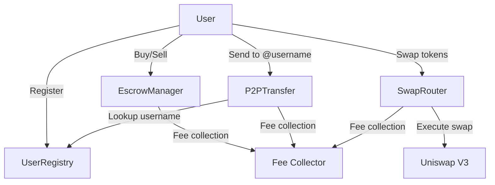

# Smart Contracts Overview

SwiftBridge is powered by four main smart contracts deployed on Base Sepolia testnet. All contracts are open-source and built with security best practices.

## Contract Addresses

| Contract | Address | BaseScan |
|----------|---------|----------|
| UserRegistry | `0xFaaE04873914c0102B3c1aA5BCE05C51d0BD3667` | [View](https://sepolia.basescan.org/address/0xFaaE04873914c0102B3c1aA5BCE05C51d0BD3667) |
| EscrowManager | `0xBd5287110A78d32A5435E97449BBA408E4F52568` | [View](https://sepolia.basescan.org/address/0xBd5287110A78d32A5435E97449BBA408E4F52568) |
| P2PTransfer | `0x2B1160DCAAbFBC21508629425901c809Db923774` | [View](https://sepolia.basescan.org/address/0x2B1160DCAAbFBC21508629425901c809Db923774) |
| SwapRouter | `0xb71A9C877B0C5CFee262E6039be2439964E0DCdf` | [View](https://sepolia.basescan.org/address/0xb71A9C877B0C5CFee262E6039be2439964E0DCdf) |

## Contract Architecture



## Core Contracts

### 1. UserRegistry

**Purpose**: Maps Telegram usernames to wallet addresses

**Key Features**:
- Register username → wallet mapping
- Update username (with 7-day cooldown)
- Username validation
- Lookup by username or address

**Use Cases**:
- Enable P2P transfers using usernames
- Simplify crypto addresses
- Social layer for blockchain

[Learn More →](/docs/contracts/user-registry)

### 2. EscrowManager

**Purpose**: Manages escrow for buy/sell operations

**Key Features**:
- Create buy/sell escrows
- Secure token locking
- Release mechanisms
- Dispute resolution
- Auto-expiry after 24 hours

**Use Cases**:
- Fiat on/offramp
- P2P OTC trading
- Secure token exchanges

[Learn More →](/docs/contracts/escrow-manager)

### 3. P2PTransfer

**Purpose**: Enables peer-to-peer transfers using usernames

**Key Features**:
- Send to Telegram username
- Pending transfers for unregistered users
- Batch transfers
- Optional messages
- Automatic delivery

**Use Cases**:
- Send crypto to friends
- Split bills
- Payments and tips

[Learn More →](/docs/contracts/p2p-transfer)

### 4. SwapRouter

**Purpose**: Token swaps via Uniswap V3

**Key Features**:
- Token-to-token swaps
- ETH-to-token swaps
- Multiple pool fee tiers
- Slippage protection
- Quote functionality

**Use Cases**:
- Exchange tokens
- Portfolio rebalancing
- DCA strategies

[Learn More →](/docs/contracts/swap-router)

## Technical Stack

### Development
- **Language**: Solidity 0.8.20
- **Framework**: Hardhat
- **Libraries**: OpenZeppelin Contracts v5.0
- **Testing**: Hardhat + Chai

### Security Features
- ✅ ReentrancyGuard on all state-changing functions
- ✅ Access control (Ownable pattern)
- ✅ Pausable for emergencies
- ✅ SafeERC20 for token transfers
- ✅ Input validation
- ✅ Custom errors for gas efficiency

### Integration
- **Uniswap V3**: For DEX functionality
- **Base Network**: Layer 2 for low fees
- **Standard ABIs**: Easy integration

## Gas Optimization

All contracts are optimized for gas efficiency:

- Via IR compilation enabled
- Custom errors instead of string reverts
- Minimal storage usage
- Batch operations where possible

**Estimated Gas Costs**:
- Register username: ~50,000 gas
- Create escrow: ~150,000 gas
- P2P transfer: ~100,000 gas
- Token swap: ~200,000 gas

## Fee Structure

| Operation | Fee | Recipient |
|-----------|-----|-----------|
| Token Swaps | 0.3% | Fee Collector |
| P2P Transfers | 0.25% | Fee Collector |
| Escrow Operations | 0.5% | Fee Collector |

## Interacting with Contracts

### Via Web3 Libraries

```javascript
import { ethers } from 'ethers';

const userRegistry = new ethers.Contract(
  '0xFaaE...3667',
  USER_REGISTRY_ABI,
  signer
);

// Register username
await userRegistry.registerUsername('myusername');

// Check if registered
const isRegistered = await userRegistry.isUsernameRegistered('myusername');
```

### Via SwiftBridge SDK (Coming Soon)

```javascript
import { SwiftBridge } from '@swiftbridge/sdk';

const bridge = new SwiftBridge({
  network: 'base-sepolia',
});

// Register username
await bridge.registerUsername('myusername');

// Send to username
await bridge.sendToUsername({
  to: 'friend',
  token: 'USDC',
  amount: '10',
});
```

## Contract Verification

All contracts are verified on BaseScan for transparency:

✅ Source code published
✅ Constructor arguments verified
✅ Compiler version documented
✅ Optimization settings public

## Upgradability

Current version (v1):
- **Not upgradeable**: Immutable contracts
- **Pausable**: Can be paused in emergencies
- **Operator management**: Trusted operators can be added/removed

Future versions may implement upgradeable proxies.

## Testing

Comprehensive test suite covers:
- All core functionality
- Edge cases
- Access control
- Error handling
- Gas optimization

Run tests:
```bash
npm test
```

## Audit Status

:::warning Not Audited
These contracts have NOT been professionally audited. This is a testnet deployment for testing purposes only. Do not use with real funds.

For mainnet deployment, a comprehensive security audit is required.
:::

## Source Code

- **GitHub**: [swiftbridge-contracts](https://github.com/SwiftBridge/swiftbridge-contracts)
- **License**: MIT
- **Solidity Version**: 0.8.20
- **Deployment**: Base Sepolia testnet

## Next Steps

- [UserRegistry Details](/docs/contracts/user-registry)
- [EscrowManager Details](/docs/contracts/escrow-manager)
- [P2PTransfer Details](/docs/contracts/p2p-transfer)
- [SwapRouter Details](/docs/contracts/swap-router)
- [Deployment Guide](/docs/contracts/deployment)

---

Questions? Join our [Telegram Community](https://t.me/swiftbridgecommunity)