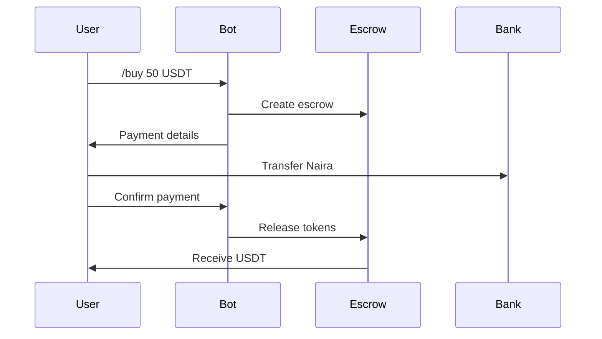
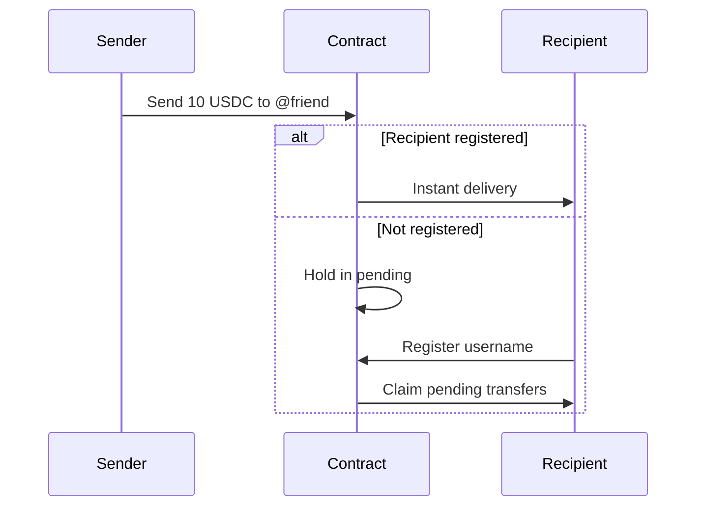

# Getting Started

Welcome to SwiftBridge! This guide will help you get started with using SwiftBridge for your crypto needs.

## What You Can Do

SwiftBridge enables you to:

- **Buy Crypto**: Purchase USDC, WETH, and other tokens with Nigerian Naira
- **Sell Crypto**: Convert your crypto back to Naira
- **Swap Tokens**: Exchange one token for another via Uniswap
- **Send to Friends**: Transfer crypto using Telegram usernames
- **Manage Portfolio**: View balances and transaction history

## Choose Your Interface

### Telegram Bot (Recommended for Beginners)

Perfect for quick transactions and easy access.

**Pros:**
- Simple commands
- No wallet setup needed initially
- Works on any device with Telegram
- Fastest for basic operations

**Get Started:**
1. Open [@swiftbridgebot](https://t.me/swiftbridgebot)
2. Send `/start`
3. Follow the instructions

[Learn More →](/docs/bot/overview)

### Mini App (Recommended for Advanced Users)

Full-featured web interface with wallet connection.

**Pros:**
- Connect your own wallet (MetaMask, etc.)
- Advanced features
- Better visualization
- Full control over transactions

**Get Started:**
1. Visit [app.swiftbridge.app](https://app.swiftbridge.app)
2. Connect your wallet
3. Start trading

[Learn More →](/docs/miniapp/overview)

## Prerequisites

### For Basic Use (Bot)
- Telegram account
- That's it! The bot will guide you through the rest

### For Advanced Use (Mini App)
- Web3 wallet (MetaMask, Trust Wallet, etc.)
- Some Base Sepolia ETH for gas fees
- Understanding of crypto wallets

## Getting Test Funds

Since SwiftBridge is currently on Base Sepolia testnet, you'll need test tokens:

1. **Get Base Sepolia ETH**:
   - Visit [Coinbase Faucet](https://www.coinbase.com/faucets/base-ethereum-goerli-faucet)
   - Connect your wallet
   - Request testnet ETH

2. **Get Test USDC**:
   - Use the bot's `/buy` command (demo mode)
   - Or use a Base Sepolia faucet

## First Steps

### 1. Register Your Username

```
/register myusername
```

This maps your Telegram username to a wallet address, allowing friends to send you crypto easily.

### 2. Check Your Balance

```
/balance
```

View all your token balances and total portfolio value.

### 3. Try a Swap

```
/swap 10 USDC to WETH
```

Exchange tokens at market rates via Uniswap.

### 4. Send to a Friend

```
/send 5 USDC to @friend
```

Transfer crypto using just their Telegram username!

## Understanding the Flow

### Buying Crypto



### P2P Transfer



## Safety Tips

:::tip Best Practices
- Start with small amounts to test
- Double-check recipient usernames
- Keep your wallet secure
- Never share private keys
- Verify transaction details before confirming
:::

:::warning Testnet Notice
Remember: This is testnet! Tokens have no real value. Practice safely before mainnet launch.
:::

## Common Questions

**Q: Do I need a crypto wallet?**
A: For the bot, not initially. For the mini app, yes.

**Q: What are the fees?**
A: Swaps: 0.3%, P2P: 0.25%, Escrow: 0.5%

**Q: How long do transactions take?**
A: Usually 10-30 seconds on Base network.

**Q: What if I send to the wrong username?**
A: Transfers to unregistered usernames can be cancelled within 24 hours.

## Next Steps

<div className="row">
  <div className="col col--6">
    <div className="card">
      <div className="card__header">
        <h3>📱 For Users</h3>
      </div>
      <div className="card__body">
        <p>Learn how to use all features as an end user</p>
      </div>
      <div className="card__footer">
        <a href="/docs/getting-started/for-users" className="button button--secondary button--block">
          User Guide
        </a>
      </div>
    </div>
  </div>
  <div className="col col--6">
    <div className="card">
      <div className="card__header">
        <h3>💻 For Developers</h3>
      </div>
      <div className="card__body">
        <p>Integrate or build on top of SwiftBridge</p>
      </div>
      <div className="card__footer">
        <a href="/docs/getting-started/for-developers" className="button button--secondary button--block">
          Developer Guide
        </a>
      </div>
    </div>
  </div>
</div>

---

Need help? Join our [Telegram Support](https://t.me/SwiftBridgeSupport) channel!