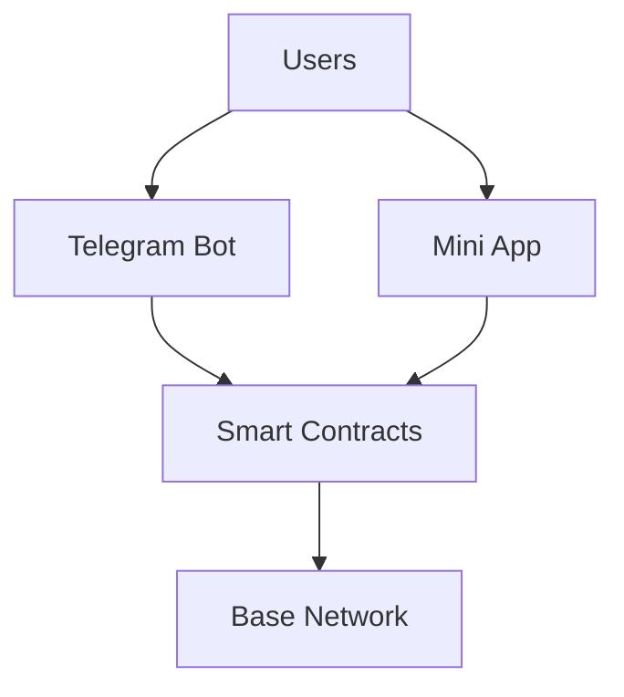

# Welcome to SwiftBridge

Welcome to the SwiftBridge documentation! SwiftBridge is a comprehensive crypto bridge solution built on Base network, enabling seamless offramp/onramp, token swaps, and P2P transfers.

## What is SwiftBridge?

SwiftBridge provides three main ways to interact with crypto on Base:

### 🤖 Telegram Bot
Easy-to-use bot with simple commands for buying, selling, swapping, and sending crypto directly in Telegram.

### 🎨 Web Mini App
Beautiful web interface with wallet connection for advanced features and better user experience.

### 🔗 Smart Contracts
Open-source, auditable smart contracts deployed on Base network that power all functionality.

## Quick Links

- **Try the Bot**: [@swiftbridgebot](https://t.me/swiftbridgebot)
- **Launch Mini App**: [app.swiftbridge.app](https://app.swiftbridge.app)
- **View Contracts**: [BaseScan](https://sepolia.basescan.org/address/0xFaaE04873914c0102B3c1aA5BCE05C51d0BD3667)
- **GitHub**: [SwiftBridge](https://github.com/SwiftBridge)

## Core Features

### 💱 Offramp/Onramp
Buy and sell crypto using Nigerian Naira with secure escrow system.

### 🔄 Token Swaps
Exchange tokens via Uniswap V3 with best rates and low fees.

### 📤 P2P Transfers
Send crypto to friends using their Telegram username - no wallet address needed!

### 👤 Username System
Register your Telegram username once and receive transfers seamlessly.

## Network Information

- **Network**: Base Sepolia (Testnet)
- **Chain ID**: 84532
- **RPC**: https://sepolia.base.org
- **Explorer**: https://sepolia.basescan.org

:::warning Testnet Only
This is currently deployed on Base Sepolia testnet for testing purposes. Do not use with real funds. Mainnet version coming soon!
:::

## Supported Tokens

- **USDC** - USD Coin
- **WETH** - Wrapped Ether
- More tokens coming soon...

## Getting Started

Choose your path:

  

    

      

        <h3>👤 I'm a User</h3>
      

      

        
Learn how to use SwiftBridge to buy, sell, swap, and send crypto.

      

      

        <a href="/docs/getting-started/for-users" className="button button--primary button--block">
          User Guide →
        </a>
      

    

  

  

    

      

        <h3>👨‍💻 I'm a Developer</h3>
      

      

        
Integrate SwiftBridge or build on top of our smart contracts.

      

      

        <a href="/docs/getting-started/for-developers" className="button button--primary button--block">
          Developer Guide →
        </a>
      

    

  

## Architecture

SwiftBridge consists of three main components:

## Support

Need help? We're here for you:

- **Telegram Support**: [@SwiftBridgeSupport](https://t.me/SwiftBridgeSupport)
- **GitHub Issues**: [Report a bug](https://github.com/SwiftBridge/swiftbridge-docs/issues)
- **Email**: support@swiftbridge.app

## Stay Updated

- Follow us on [Twitter](https://twitter.com/swiftbridge)
- Join our [Telegram Community](https://t.me/swiftbridgecommunity)
- Read our [Blog](/blog)

---

Ready to get started? Check out the [Quick Start Guide](/docs/getting-started/overview)!